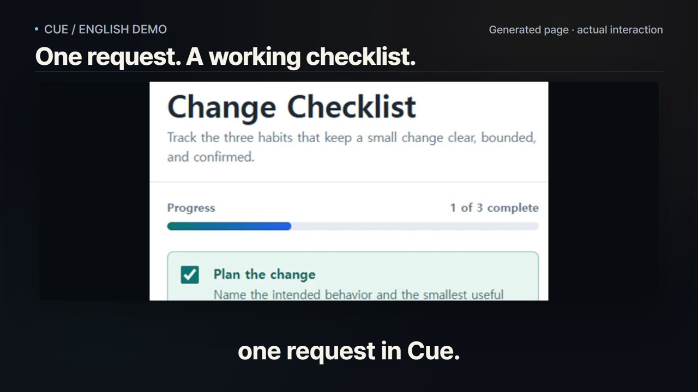
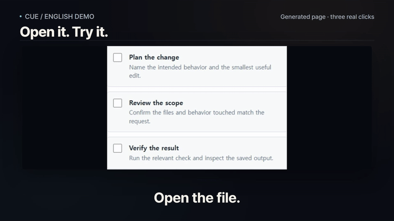
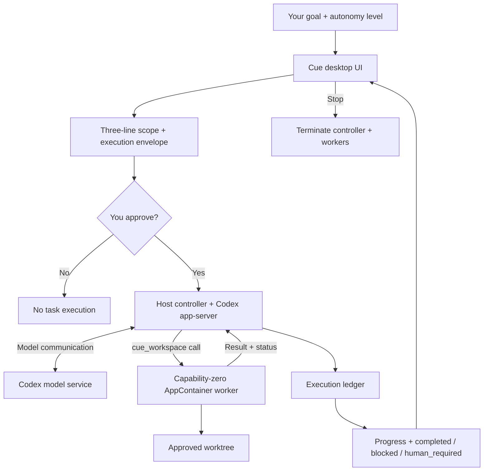

# Cue

### Give AI a goal. Keep control of the work.

Cue is a Windows desktop app that turns a coding goal into an explicit scope you approve, runs workspace actions through isolated workers, and shows a recorded result.

**Describe → Review → Approve → See what changed.**

[Watch the 34-second demo](docs/assets/cue-demo-en.mp4) · [Get started](#get-started) · [How it works](#how-it-works) · [한국어 요약](#한국어-요약)

*v0.1 · Windows 11 · Electron · Codex-powered · Standalone; no Buzz required*

[](docs/assets/cue-demo-en.mp4)

## Why Cue?

Delegating a coding task should make the next step easier to understand. Cue puts the decision before execution and the evidence after it.

| What you need | What Cue puts in front of you |
| --- | --- |
| A clear starting point | A natural-language goal and a three-line scope summary. |
| A say in what can change | An execution envelope showing the workspace and allowed actions, approved before work starts. |
| Boundaries during execution | Workspace commands run through capability-zero Windows AppContainer workers; the approved envelope does not expand after approval. |
| A result you can inspect | Ledger-backed progress, worker PIDs, and a completed, blocked, or human-required outcome. |
| A way to interrupt | **Stop** terminates the active controller and AppContainer workers. |

Start with a small, file-changing task: create a single-page checklist, update a local file, or make a focused change you can inspect. See [current limits](#current-limits) before choosing a workflow.

## The flow in 30 seconds

1. **Describe the outcome.** Choose a workspace, enter a goal, and select the autonomy level before preparing the scope.
2. **Review the boundaries.** Read what Cue will do, where it can work, and what it will leave untouched.
3. **Approve and follow along.** Start the approved run and watch ledger-backed progress. Stop it if needed.
4. **Inspect the result.** Open the generated file and try it. A blocked run remains visibly blocked.

**In the demo:** one successful run creates an interactive HTML checklist. You see the actual app, approval, completion, and three working checkboxes.

[](docs/assets/cue-demo-en.mp4)

*A short, silent loop of the actual result. Click to open the full English demo.*

[Watch / download the English MP4](docs/assets/cue-demo-en.mp4) · [English subtitles](docs/assets/cue-demo-en.srt) · [Storyboard and capture notes](docs/DEMO.md)

The demo is edited to 34 seconds; this is not a completion-time promise. UI strings were translated for the recording; the current app UI is Korean. The demo does not certify every model-generated check or replace the verification evidence below.

## Get started

### Requirements

- Windows 11.
- Node.js and npm; native dependencies may require a compatible Windows build toolchain.
- Codex CLI `0.153.0` and an authenticated user profile at `%USERPROFILE%\.codex\auth.json`.

```powershell
git clone https://github.com/zenovis2-create/cue.git
cd cue
npm ci
npm --prefix daemon ci
npm start
```

The first launch opens a workspace picker. Cue runs independently; the default adapter is `none`, and Buzz is not a required runtime.

Cue pins and verifies the default Codex executable's SHA-256. To use another `CUE_VENDOR_CODEX`, also provide that file's exact 64-character SHA-256 in `CUE_VENDOR_CODEX_SHA256`. A mismatch prevents model startup. Credential values are not written to the app UI, worker environment, or ledger.

## How it works



### Execution boundaries

- **Host:** the Codex app-server handles model communication from a separate, isolated controller working directory. Codex's built-in shell and permission-request tools are disabled. The model connection is on the host; this is not an offline-only app.
- **Workers:** each `cue_workspace` dynamic tool call creates a capability-zero Windows AppContainer. Commands and file operations run in the approved worktree.
- Callers cannot supply `cwd`; the server fixes it to the approved worktree. Writes outside the worktree and junction-based write escapes are rejected at the OS boundary.
- Ordinary socket access from capability-zero workers is denied by the OS. The older P3-16 network policy is a separate **detect-and-stop** layer, not syscall enforcement.
- The execution envelope cannot expand after approval. Failures, crashes, and policy violations are reported as `blocked` / `human_required`, not `completed`.

## Verification

The commands below are the project's verification entry points. Live model runs can incur costs; a demo recording is not a substitute for these checks.

```powershell
npm test
npm run evidence:p12:manifest
npm run evidence:p12
npm run evidence:p12:electron
npm run evidence:p12:cancel
npm run evidence:p12:stop
npm run evidence:p12:mutation
npm run evidence:p12:source
```

`evidence:p12` executes two distinct goals, A/B, with a real Codex model. `evidence:p12:electron` checks a real Electron window. `evidence:p12:stop` uses a deterministic host-controller fixture and real capability-zero AppContainer workers to verify stop and reclamation; it does not replace the vendor-model A/B evidence. `evidence:p12:mutation` removes fail-fast, writer-lifecycle, and parent-death safeguards in disposable copies outside the checkout to verify regression sensitivity.

The release finalizer recomputes the strict staged-source index manifest and checks the matching source digest, gate summary, independent security/release reviews, and receipt SHA-256 values. Missing or mismatched inputs, unlisted P12 evidence, or unstaged source drift prevent creation of `v01_verdict.json`.

| Evidence | What it records |
| --- | --- |
| [Tool manifest](evidence/P12/p12_manifest.json) | Full tool manifest and hashes from the pinned Codex outbound request. |
| [Live A/B runs](evidence/P12/p12_live_result.json) | Goals, envelopes, output hashes, controller/worker PIDs, and ordered provenance. |
| [Electron window](evidence/P12/p12_electron_window_result.json) | Actual window and runtime security values, with companion PNG evidence. |
| [Picker cancellation](evidence/P12/p12_electron_cancel_result.json) | Fail-closed behavior when the first workspace selection is canceled. |
| [Stop](evidence/P12/p12_stop_result.json) | Controller and worker termination/reclamation. |
| [Mutation checks](evidence/P12/p12_mutation_result.json) | Sensitivity to regressions in three safety lanes. |
| [Source manifest](evidence/P12/p12_source_manifest.json) | Staged source tree binding, excluding evidence. |
| [Tracked verdict](evidence/P12/v01_verdict.json) | Bound source, gate, review, and receipt hashes. |

**Evidence scope:** the retained P12 release artifacts belong to the [sealed v0.1 source snapshot](https://github.com/zenovis2-create/cue/tree/51d1e36cacc30bc8ae6040284ea74c7814fb20fc). This documentation/demo update does not regenerate that verdict or claim it certifies the new tree. For a new release, bind source and evidence together again. The historical Phase 11 NO-GO checkpoint remains in `evidence/P11/`. P12's verdict is tracked with source and evidence in the same release commit; a separate, out-of-checkout post-commit attestation binds the commit by recomputing the source manifest from the HEAD tree, avoiding a circular commit hash.

### External reproduction

Outsiders can independently verify Cue's published claims without a paid CTA: see **[docs/EXTERNAL_REPRODUCTION.md](docs/EXTERNAL_REPRODUCTION.md)** (Tier A = `npm test` / `evidence:p12:stop` on Windows 11; report an issue with OS, Node, commit SHA, and results).

### Issues and response targets

See [docs/ISSUE_SLA.md](docs/ISSUE_SLA.md): first response within 24h, labels within 48h, `critical` (cannot install/start) same day. Use the issue forms; for independent verification see [docs/EXTERNAL_REPRODUCTION.md](docs/EXTERNAL_REPRODUCTION.md).

## Current limits

v0.1 has explicit boundaries. Treat these as workflow constraints when deciding whether Cue fits your task.

- **P3-16 PARTIAL:** the older network policy detects and stops; it must not be relabeled as syscall enforcement. Separate capability-zero worker socket checks demonstrate OS denial.
- **P4-2 PARTIAL:** the OS process tree was checked, but `Win32_Process` does not expose worker cwd. Independent OS-level cwd inspection remains unverified.
- **P6-3 PARTIAL:** daemon adapter handoff after front-door termination was checked; real Buzz delivery was not performed to avoid external state changes. Buzz is optional.
- **Goal verification PARTIAL:** `goal_relevant_verification` correlates before/after SHA-256, expected-path changes, and the final report for file-changing goals. It does not generally judge research or summary tasks that change no files.

Phase 12 retains these release limitations verbatim:

- P3-16 network is detection-only
- P4-2 `Win32_Process` does not supply cwd
- P6-3 real Buzz delivery unverified
- Worker child processes are prohibited; commands requiring nested subprocesses are unsupported. Request each executable through a separate `cue_workspace` call so Cue can resolve and verify it outside writable worktrees.
- goal verification is oriented toward file-changing goals

## 한국어 요약

**Cue는 코딩 목표를 입력하고, 실행 범위를 승인한 뒤, 실제 결과를 확인하는 Windows 데스크톱 앱입니다.** 작업 폴더와 허용 동작을 먼저 확인하고, 승인된 범위에서 격리 작업자가 실행합니다. 진행 상태와 완료·막힘 결과는 원장을 바탕으로 표시하며, 실행 중에는 중단할 수 있습니다.

- Windows 11, Node.js/npm, 인증된 Codex CLI가 필요합니다. Buzz 없이 독립 실행됩니다.
- [34초 영문 데모](docs/assets/cue-demo-en.mp4)는 실제 체크리스트 생성·조작 과정입니다. 대기 시간은 편집했으며, UI만 촬영용으로 영어화했습니다. 현재 앱 UI는 한국어입니다.
- v0.1은 파일을 변경하는 목표 중심입니다. 자식 프로세스를 만드는 명령, 일반적인 조사·요약 목표 판정, 실제 Buzz 전달 등에는 위의 한계가 있습니다.
- 기존 검증 명령과 증거를 유지했습니다. 이번 문서·영상 추가는 새로운 릴리스 보안 인증을 의미하지 않습니다.

Try a small task with a result you can inspect. [Share a reproducible issue](https://github.com/zenovis2-create/cue/issues) if it gets blocked—and star the repository if this is the workflow you want to see grow.
