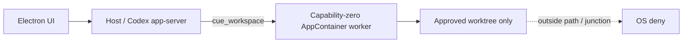

# Cue

**Natural-language coding goals that stay inside the folder you approved.**

Cue is a Windows 11 Electron desktop app. You describe a coding goal, review a short execution envelope, pick an autonomy level, then approve. After that, work runs only in the approved worktree — each tool call spins a **capability-zero Windows AppContainer** worker. Paths outside the worktree (including junction escapes) are rejected at the OS boundary.

[](#requirements)
[](#v01-limits)
[](#requirements)

**Repo:** [github.com/zenovis2-create/cue](https://github.com/zenovis2-create/cue)

> ⭐ If hard isolation for coding agents matters to you, star the repo — it helps more people find Cue.

<!-- Demo assets: drop files into docs/assets/ then uncomment
<p align="center">
  
</p>
<p align="center">
  
  
  
</p>
-->

📸 **Demo recording checklist:** see [`docs/DEMO.md`](docs/DEMO.md)

---

## Why Cue

Most coding agents are powerful and then ask you to trust the prompt.

Cue flips that: **autonomy sits on a hard floor**.

| Before approve | After approve |
| --- | --- |
| Nothing runs | Envelope does **not** expand |
| You review a 3-line summary + execution envelope | Commands/files stay in the approved worktree |
| You choose autonomy level | Outside paths / junction writes → OS reject |
| — | **Stop** kills controller + AppContainer worker |

Credentials are **not** written to the app UI, worker environment, or ledger.

Buzz is **not** required. The default adapter is `none`.

---

## 30-second flow

1. Enter a natural-language goal  
2. Review the three-line summary and execution envelope  
3. Choose an autonomy level  
4. Click **Approve and start**  
5. Watch progress, isolation tool PIDs, and completion / blocked / human-required in the ledger  
6. Click **Stop** anytime to terminate the live controller and AppContainer worker  

---

## Architecture (host vs worker)


```mermaid
flowchart LR
  UI[Electron UI] --> Host[Host / Codex app-server]
  Host -->|cue_workspace| AC[Capability-zero AppContainer worker]
  AC --> WT[Approved worktree only]
  WT -.->|outside path / junction| Deny[OS deny]
```

- **Host:** talks to Codex app-server / the model. Uses an isolated controller cwd. Disables Codex built-in shell and permission-request tools.
- **Worker:** every `cue_workspace` dynamic tool call creates a capability-zero Windows AppContainer. Real commands and file work happen only in the approved worktree.
- Callers cannot set `cwd`; the server pins it to the approved worktree.
- Ordinary socket access from capability-zero workers is denied by the OS. Existing P3-16 policy is a separate **detect-then-stop** layer (not claimed as syscall forcing).

---

## Requirements

- Windows 11  
- Node.js and npm  
- Codex CLI `0.154.0` with an authenticated user profile at `%USERPROFILE%\.codex\auth.json`

Cue pin-verifies the default Codex executable SHA-256. The pinned value is bound to the
`@openai/codex@0.154.0-win32-x64` npm publish integrity, its SLSA provenance attestation, and
the binary's `OpenAI OpCo, LLC` Authenticode signature. To use a different `CUE_VENDOR_CODEX`,
also set `CUE_VENDOR_CODEX_SHA256` to that file's 64-char SHA-256. On mismatch, Cue will not
start the model process.

---

## Quick start

```bash
npm install
npm start
```

On first launch, Cue asks you to choose a work folder once. Then follow the flow above.

---

## Verification

The manifest probe used by `npm test` requires the audited Codex 0.154.0 bytes,
not merely a matching version label. Without an explicit override it checks the
standard global npm payload and then `%LOCALAPPDATA%/Programs/OpenAI/Codex/bin/codex.exe`,
accepting only the fixed SHA-256 and recording the selected path/source. This
allows a side-by-side pinned installation to survive global CLI updates. An
explicit `CUE_VENDOR_CODEX` that is missing or mismatched is rejected without
fallback; `CUE_VENDOR_CODEX_SHA256` cannot override the probe's audited pin.
No tests are skipped when the pin is unavailable, and nothing is downloaded.
The probe copies the pinned executable into an owned temporary vendor directory
and rechecks the copied hash before launch, preserving the existing vendor-path
guard. It uses a fresh credential-free home and a loopback fake API, not a paid
model request. A PASS receipt is published only after local teardown succeeds.
This test-tool lookup does not change the application's configured executable.

```bash
npm test
npm run evidence:p12:manifest
npm run evidence:p12
npm run evidence:p12:electron
npm run evidence:p12:cancel
npm run evidence:p12:stop
npm run evidence:p12:mutation
npm run evidence:p12:source
```

`evidence:p12` runs real Codex model goals A/B (may incur cost). `evidence:p12:electron` validates a real Electron window. `evidence:p12:stop` uses a deterministic host-controller fixture plus a real capability-zero AppContainer worker for stop/reap — it does not replace live vendor-model A/B evidence. `evidence:p12:mutation` checks fail-fast / writer lifecycle / parent-death safety on a disposable copy outside checkout.

The release finalizer recomputes the staged source strict index manifest and cross-checks gate summary, independent security/release reviews, and each receipt SHA-256. Mismatch, missing items, unlisted P12 evidence, or unstaged source drift → no `v01_verdict.json`.

### Key evidence

- `evidence/P12/p12_manifest.json` — pinned Codex outbound request tool manifest + hashes  
- `evidence/P12/p12_live_result.json` — live goals A/B, envelopes, artifact hashes, controller/worker PIDs, ordered provenance  
- `evidence/P12/p12_electron_window_result.json` / PNG — real Electron window + runtime security values  
- `evidence/P12/p12_electron_cancel_result.json` — fail-closed on first workspace cancel  
- `evidence/P12/p12_stop_result.json` — live controller + AppContainer worker stop/reap  
- `evidence/P12/p12_mutation_result.json` — mutation sensitivity across three safety lanes  
- `evidence/P12/p12_source_manifest.json` — staged source tree binding (excluding evidence)  
- `evidence/P12/v01_verdict.json` — tracked verdict binding source · gate · review · receipt hashes  

---

## v0.1 limits

Be honest with yourself and with users:

- **P3-16 PARTIAL:** network policy is detect-then-stop, not syscall forcing. Separate OS socket checks still prove capability-zero worker denial.  
- **P4-2 PARTIAL:** OS process tree verified; Windows `Win32_Process` does not supply worker cwd, so independent OS cwd lookup is unverified.  
- **P6-3 PARTIAL:** front-door shutdown → daemon adapter handoff verified; real Buzz delivery not executed (avoids external state change). Buzz is not required for Cue.  
- **Goal verification PARTIAL:** `goal_relevant_verification` covers file-changing goals (before/after SHA-256, expected path changes, final report correlation). It does **not** claim general judgment for investigate/summarize goals that change no files.  
- Worker child processes are prohibited; commands that need nested subprocesses are unsupported. Request each executable through a separate `cue_workspace` call so Cue can resolve/verify it outside writable worktrees.

Phase 11 NO-GO history lives in `evidence/P11/`. Phase 12 `v01_verdict.json` is tracked with source + evidence on the same release commit (commit SHA itself is bound via post-commit attestation outside checkout to avoid cycles).

---

## Launch checklist for maintainers

Repo description, topics, and demo recording steps: [`docs/LAUNCH.md`](docs/LAUNCH.md) · [`docs/DEMO.md`](docs/DEMO.md)

---

## Korean summary / 한국어 요약

**Cue**는 Windows 11용 Electron 앱입니다. 자연어 코딩 목표를 넣고, 실행 봉투를 확인·승인한 뒤에만 움직입니다. 실제 작업은 선택한 작업 폴더 안의 **capability-zero AppContainer** 작업자에서만 수행되며, worktree 밖 경로와 junction 우회 쓰기는 OS에서 거부됩니다. 자격증명은 UI·작업자 환경·원장에 남기지 않습니다. Buzz는 필수가 아닙니다.

```bash
npm install
npm start
```

자세한 요구 사항·검증·한계는 위의 영문 섹션을 기준으로 합니다.

---

## Star / feedback

Cue is early (v0.1). Stars, issues, and “what would you break first?” reports all help.

**https://github.com/zenovis2-create/cue**
